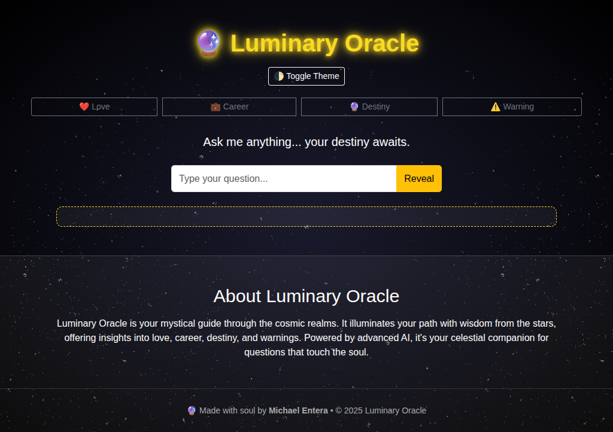

# 🔮 DreamWeaver AI

**DreamWeaver AI** is a mystical, minimalist web app that gives you magical and thought-provoking predictions based on your chosen category — love, career, destiny, or warning. Built with HTML, CSS, Bootstrap, and vanilla JavaScript.

🪄 Live Site: [https://dreamweaver-ai-khaki.vercel.app/](https://dreamweaver-ai-khaki.vercel.app/)

---

## ✨ Features

- Toggle between Dark Mode 🌙 and Light Mode ☀️
- Category-based predictions: ❤️ Love, 💼 Career, 🔮 Destiny, ⚠️ Warning
- Typing animation for immersive responses
- Fully responsive design (mobile to desktop)
- Starry animated background
- Clean, aesthetic UI

---

## 📸 Screenshot

---

## 📜 License

© 2025 Made with ❤️ by **Michael Entera**  
DreamWeaver AI is open for inspiration, reuse, and magic ✨

---
